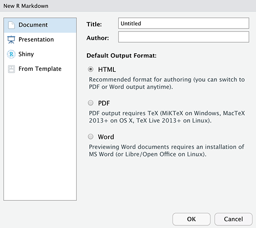

# Unit 1: Creating an R Markdown document

## Unit Learning Objectives
- To become familiar with the R Markdown syntax.
- To be able to generate a simple About Me R Markdown document. 

## Unit Difficulty
Beginner 

## Terms to Know for Unit 1

<b>R Markdown</b>: An authoring framework which allows you to create a variety of documents such as presentations, webpages, and html documents.

<b>YAML</b>: Stands for "YAML Ain't Markup Language". YAML is a user-friendly and readable data serialization language for a variety of programming languages.


### Lesson 1: Introduction to R Markdown
R Markdown is a framework which you can make dynamic documents and make your research reproducible. R Markdown documents have three parts which are composed of the text that make up the documents, the code chunks that either static, automatic, or run based on a user prompt. Finally, there's the YAML metadata which gives you information about the document. 

You have many options when it comes to creating R Markdown documents such as creating websites, slides, and dashboards. For today's lesson, we will just create a simple R Markdown document that will give basic information about yourself. Having a CV/Resume or anything that you have previously submitted as a bio will be helpful! It might be weird talking about yourself, but you've done a lot so it's time to let others know what you're doing!

For more specific information about R Markdown, consult this very helpful [cheat sheet](https://www.rstudio.com/wp-content/uploads/2015/02/rmarkdown-cheatsheet.pdf) or the [RStudio site](https://rmarkdown.rstudio.com/) about R Markdown.


Make sure to install R Markdown along with the packages that is needed to R Markdown(known as dependencies) before making your R Markdown document.

```{r chunk-one, echo = TRUE, eval = FALSE}
install.packages("rmarkdown", dependencies = TRUE)
library(rmarkdown)
```

## Lesson 2: Making an R Markdown Document
Let's make an R Markdown Document! Let's start out making a document which have some headers and italicized text. Before we do that, we need to open up an R Markdown document! 

Create a folder called **rmarkdown_rladiesstl**. I recommend that you save this folder in a convenient location such as your Documents folder.

Go to File -> New File -> R Markdown to open an R Markdown document. Keep the option to **Document**. Fill in the information in the **Title:** and **Author:** fields and keep the default output format to HTML. Click **OK**.



Clear everything in the document with two exceptions:

  - The code chunk which includes: `knitr::opts_chunk$set(echo = FALSE)`.
  - The YAML data which is delinated by an `---`.


### Creating Headers 
R Markdown has different types of headers. Here are some of the headers with the accompanying code for each header. 

# This is Header 1

`# This is Header 1`

## This is Header 2

`## This is Header 2`

### This is Header 3

`### This is Header 3`

...and so on. See a pattern? 

#### Exercise 1: Creating an R Markdown Document About You: Creating Headers

Create five sections using header 2 `##`. These sections are Name, Biography, Research Interests, Education, and Hobbies.

### Changing Text

To *italicize* text, you add an `*` before and after the sentence.
*This is italicized.*
`*This is italicized.*`

To make text **bold**, you add an `**` before and after the sentence.
**This is bold.**
`**This is bold.**`

#### Exercise 2: Creating an R Markdown Document About You: Changing Text
Fill in the information under each section. Under the **Biography** section, make your text italicized and under **Education** make your text bold.

### Inserting Images
If you want to insert images, you should create an images folder where you are storing your R Markdown document and put your image in that folder. You can then refer to the location of your image by 
adding this code:
``

*Note: myimages.jpg is being used as an example image. You should use the file name of the image you want to use.*

#### Exercise 3: Creating an R Markdown Document About You: Adding an Image
Above the **Name** header, create an image link in the same location of where your R Markdown document is located.

### Knitting Your Document

Click the Knit button and **Knit to HTML**. In the preview window, click on the "Open in Browser" button to see what it looks like in a web browser.

### Bonus
One great thing about R Markdown is that you can run your plots or other visualizations within the document! Create a new R Markdown document and read the default information that comes with the template. It gives information on how to embed R code chunks in which the code chunk is visible and when the code chunk is invisible. You might want to have the code chunk be visible if you are explaining a process in the code itself so you will want to set `echo = TRUE` when your R Markdown document is generated. However, if you are just interested in showing the result of the code, then you just need to set `echo = FALSE`. Go ahead and run the plots in the R Markdown document that you just opened!

