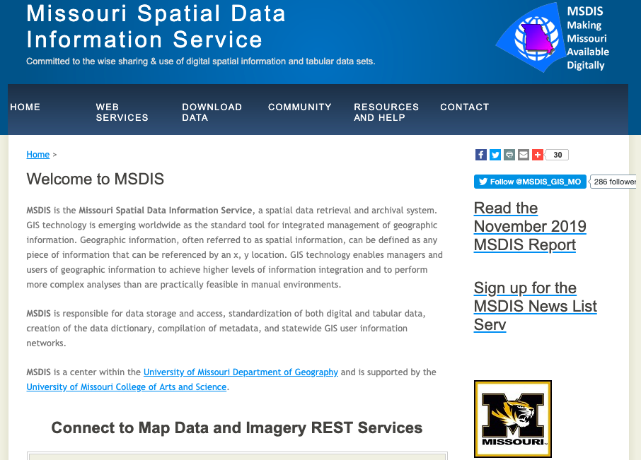
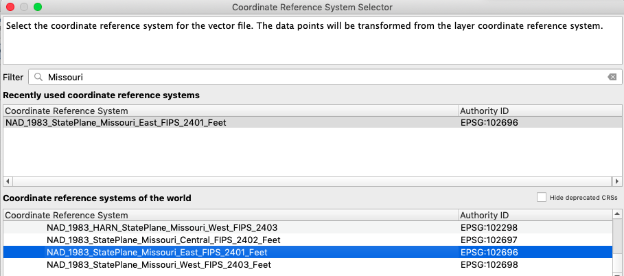
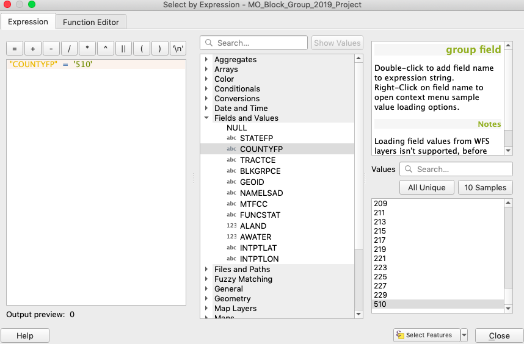
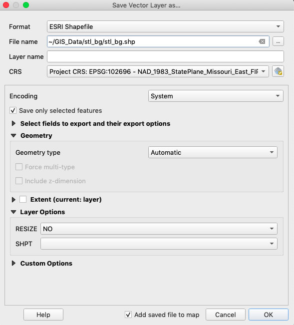
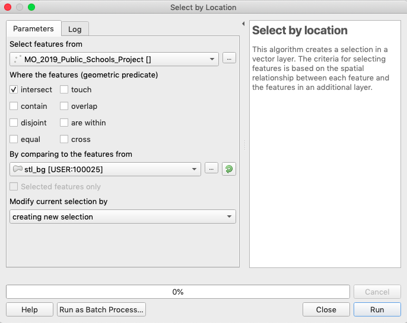

# Introduction to QGIS - Vector Data: Part 1

## Units
### Unit 1: Introduction to Vector Data
### Unit 2: Finding and Downloading GIS Data
### Unit 3: Prepare GIS Data in a QGIS Workspace
### Unit 4: Producing Basic Queries 
### Unit 5: Joining Tabular Data to Vector Data
### Unit 6: Computing values with Field Calculator

## Unit 1: Introduction to Vector Data
### Unit Objectives
  1. Define Geographic Information Systems (GIS) 
  2. Describe the two types of GIS data.
  3. List three types of GIS vector data.
  4. Describe the structure of GIS data.

### Terms to know
- Geographic Information Systems(GIS): A computer system that is used to capture, display, and analyze data that has a spatial reference on Earth.

- vector data: GIS data that represents data on the earth through points, lines, and polygons.

- raster data: GIS data that represents data on the earth through a grid of pixels.

- shapefile: A file format for vector data, which comprises of at least four different file types.

#### GIS, Vector and Raster GIS Data
Geographic Information Systems (GIS) is a very powerful tool when it comes to understanding physical and socio-cultural processes on the earth. There are various types of GIS software out there, however a common thread with the software is the data they deal with. GIS uses vector data and raster data to represent features on the earth. Vector data is made up of points, lines and polygons. An example of point data could be a points representing school locations (which you will see in today's workshop). An example of line data could be lines representing rivers and streams. Finally, an example of polygon data could be school districts.

On the other hand, raster data is a grid of pixels in which each value represents a feature on the earth. For example each pixel of a raster image of a forest profile could represent the type of tree in the forest. For today's workshop we will be exclusively focusing on vector data. The GIS software that we will be using today is Quantum GIS, also known as QGIS. QGIS is a very convenient software, for it is available for both Mac and Windows machines and it is free and open source. 

One of the file formats that represent vector data is a shapefile, which is actually made of up of various filetypes such as .shp, .shx, .dbf, .prj, and .xml. We will be working with shapefiles for this workshop. The reason that shapefiles are made up of various files is due to the nature of vector data. Vector data is not just visual in nature; a database underlies vector data which in which each point, line, and polygon is represented by a record in a database. In addition, a shapefile might contain metadata, which is data about data. In short, metadata gives you information about how the shapefile was derived.

## Unit 2: Finding and Downloading GIS Data
### Unit Objectives
1. Identifying relevant websites to download GIS data for an area of interest.
2. Use relevant websites to download GIS data.

### Terms to know
- [Census block group](https://www2.census.gov/geo/pdfs/reference/GARM/Ch11GARM.pdf): The smallest geographic unit in which the Census unit collects census data. 
- TIGER Lines: Geographic features for all 50 states from the  *Topographically Integrated Geographic Encoding and Referencing* database(thus the acronym TIGER). Examples of TIGER line products are rivers, roads, and administrative boundaries such as counties.

#### GIS Data Sources: Where to go?
As mentioned in the [introduction](https://github.com/momiji15/yearntolearn/blob/master/library_research_workshops/QGIS/Intro_to_QGIS_Vector_Data/intro_to_qgis_vector_intro.md
), our final project will be a map that displays schools in St. Louis city and shows the student to teacher ratio by census block group. So the GIS data we will need are as follows:
1. public schools in St. Louis city.
2. Census block group data for St. city.

So where do we start? Let's work our way down this short list.

##### Schools data
[The Missouri Spatial Data Information Service(MSDIS)](http://msdis.missouri.edu/) has a variety of spatial data over the state of Missouri, including our schools data.

1. Go to the MSDIS website.
2. Under the **Download Data** dropdown menu, click on **Data Portal**. 
3. Scroll down on the site and click on the **Education** icon.

4. You will see three results. Scroll down and you will see **MO 2019 Public Schools**. Click on the text and you will be directed to a page that shows you a preview of the data along with the various attributes of the data. On the right side of the page, click on the **Download** button which will display a drop-down menu. Click on shapefile and the file will automatically download. 

5. Before we move the data from the Downloads folder, we need to make a folder on your Desktop to store your GIS data. File management is essential to GIS and it is important to implement sound data management skills for GIS project management. You will learn such skills throughout this workshop. Create a folder and name it **GIS_Data**. It is important to not use spaces in naming your folders and files due to readability issues that could occur later on. Make sure to use an underscore in place of a space to prevent any problems down the road. Also, notice that **MO_2019_Public_Schools** also use underscores in place of spaces in the zipped file.

6. After creating your folder, move the **MO_2019_Public_Schools** shapefile to your **GIS_Data** folder.

##### Census Tracts

Option 1: NHGIS
An easy way to get the block group shapefiles and the corresponding csv files that you need for this workshop is through the [IPUMS NHGIS](https://www.nhgis.org)website. The nice thing about NHGIS data is that it is already formatted so you can easily join the csv files to your shapefiles which you will be doing later on in this workshop. You should have registered for an NHGIS account before the workshop, but if not, please do it now. 

1. Navigate to the NHGIS website and click on the **Get Data**  button.

2. Click on the **Geographic Levels** button. Under **Most Popular**, click the green round button next to **Block Group**. It should turn into a checked checkbox.

3. Click on the **Years** button. Under **5 Year Ranges** click **2013-2017**.

4. Click on the **Topics** button. In the **Table Topic Filter** section, click on the green round button next to **Total Population**. It should turn into a checked checkbox.

5. Your results should look like this: 

6. We will need to get the appropriate source table and GIS file. Click on 

Option 2: US Census Bureau
Now it's time to download your census block groups. You can do this from the [Census Bureau TIGER/Line Shapefiles](https://www.census.gov/cgi-bin/geo/shapefiles/index.php) website.

1. Go to the U.S. Census Bureau TIGER/Line Shapefiles website.

2. On the drop-down menu, in **Select Year**, select **2019** and in **Select a Layer Type** select **Block Groups**. Click **Submit**.

3. You will be prompted to another page in which you will need to choose the state. In the dropdown menu, choose **Missouri** and click the **Download** button. Move your downloaded shapefile to your **GIS_Data folder**.

4. To use the files in QGIS, you will need to unzip the folders. Right-click on **MO_2019_Public_Schools**, and unzip the file. If you are using a Mac, you will go to **Open With** and then **Archive Utility**. For Windows, after right-clicking, go to **Extract All** and follow the instructions. 

## Unit 3: Prepare GIS Data in a QGIS Workspace

### Unit Objectives
1. Adding vector data to a QGIS workspace.
2. Adding a csv file to a QGIS workspace.
3. Adding projections to your vector data.

### Terms to Know
- projection: A mathematical function that transforms the earth's 3D surface on a 2D surface.
Now that you have unzipped your data, it is not ready to put your shapefiles in a QGIS workspace.

1. Open up QGIS.

2. On the top menu bar, go to **File > New** to open a new workspace. You can also click on the left-most icon that looks like a blank sheet of paper to open a new workspace.

3. Now, you will add the Missouri public schools and census block group shapefiles to your workspace. Press the **Open Data Source Manager** button which is below the **New Project** button.

4. Make sure that **Vector** is highlighted on the left menu panel on the **Data Source Manager**. Under **Source > Vector Dataset(s)**, click  **...** and navigate to the location of your shapefiles which should be in the **GIS_Data** folder. Click on the **tl_2019_29_bg** folder, select **tl_2019_29.shp**, and click **Add**.  In the Data Source Manager, click **Add**.

5. Now we're going to add the schools. Again, click on the ***...*** under **Source and Vector Dataset(s)** and navigate back to your GIS_Data folder and then to the **MO_2019_Public_Schools** folder and then select **MO_2019_Public_Schools.shp**, and click **Add**. In the Data Source Manager, click **Add**.

6. Your workspace should look similar to this. Don't be concerned about the colors of the shapefiles in your workspace being different than what you see here. If you don't see the schools, then they are probably below your block groups.  You can see the drawing order of your shapefiles in the **Layers** section. If **MO_2019_Public_Schools** are below **tl_2019_29_bg**, then you will not be able to see them. In this case, click on **MO_2019_Public_Schools** and drag it on top of **tl_2019_29_bg**. 

7. Before we proceed, we need to save the document. On the top menu bar, click on **Project > Save** and navigate to your **GIS_Data** folder. In **Save as**, name the workspace **stl_schools** and click **Save**. On the top of the Window, you should see the name of your workspace.

8. We need to project our data. At times, you can easily tell that the data is not projected for the boundaries look distorted and the edges of the boundaries are straight lines. To project our data, we will export each shapefile and create a new layer with our new projection.

9. Let's first project the **MO_2019_Public_Schools** shapefile. Right-click on the shapefile and click **Export > Save Features As**.

10. Keep the **Format** as an **ESRI Shapefile**. Click the **...** next to the text box under **File Name**, navigate to your **GIS_Data** folder and then **MO_2019_Public_Schools** folder. Name your new layer **MO_2019_Public_Schools_Project**. 

11. Click the **Select CRS** button in **CRS**. 

12. Under **Filter**, type **Missouri** to get to the projection that we need. Under **Coordinate Reference Systems of the World**, highlight **NAD_1983_StatePlane_Missouri_East_FIPS_2401_Feet**. 

13. Click **OK** and **OK** in the **Save Vector Layer as...** dialogue box. You will see your newly created shapefile in the Layers section.

14. Now we will do the same with the Missouri census tracts. Right-click on the shapefile and click **Export > Save Features As**.

15. As with **MO_2019_Public Schools**, you will keep the format to **ESRI Shapefile**. Navigate to your **GIS_Data** folder and then to your **tl_2019_29_bg** folder. Name your new layer **MO_2019_BG_Project**.

16.  Click the **Select CRS** button in **CRS**. 

17. Under **Recently Used Coordinate Systems**, you should see the projection that you just used. Click on **NAD_1983_StatePlane_Missouri_East_FIPS_2401_Feet** and click on **OK** and then **OK** in the **Save Vector Layer as...** dialogue box.

18. In the **Layers** panel, uncheck **MO_2019_Public_Schools** and **tl_2019_29_bg.** You might think that your project window looks strange. You might only see the block groups shapefile, but not the schools shapefile. What's going on here? You're not able to see both of these properly because the projection of the project needs to be changed. Once we change that, all of the data will be displayed correctly. 

19. On the bottom right-hand corner of the QGIS project window, you will see a button that says **EPSG: 4326**. Click the button.

20. This will display the **Project Coordinate Reference System (CRS)** window. Under **Recently used coordinate reference systems**, you should see **NAD_1983_StatePlane_Missouri_East_FIPS_2401_Feet** which you can confirm for the EPSG is **102696**. Click **OK**. As you can see, the shapes have changed and are no longer distorted. You can also see that the projection of the QGIS project is in the correct projection indicated by the EPSG number being **102696**.

*Troubleshooting Tip*: 
If you are having issues with the shapefiles displaying properly, then create a new project and then add your shapefiles in your new project. The project will change to the projection of the first shapefile that you add. Save your project and continue to do the work from this project.

## Unit 4: Producing Basic Queries

### Unit Objectives
1. Produce a *select features by expression* query.
2. Produce a *select features by location* query.

### Terms to know
- FIPS code: A numbers which uniquely identifies a geographic unit such as a county or state. FIPS stands for *Federal Information Processing Standard*. State level FIPS codes have two digits while county level FIPS codes have five digits in which the first two digits are the state FIPS code. 

With QGIS, you can select features either by expression or by location. When you select features by expression, you are selecting a features of vector data based on a particular attribute such as all of the census block groups in a specific county. When you select features by location, you can select features of vector data based on their location, such as selecting all the cenus block groups that are contained within a St. Louis City polygon. Let's give both a try.

#### Producing a select features by expression query 
1. Right-click on **MO_2019_BG_Project** and click on **Open Attribute Table**.

2. As you can see, a database underlies this polygon dataset in which there are records for each feature contained in the s
   dataset. You can see this by clicking on the number for the first record and right-click the value that is in 
   **STATEFP**. Then click on **Zoom to Feature** which zooms into the feature and highlights it as well. 
3. To zoom out to see the entire Missouri block groups, click on the **Zoom to Layer** button in the QGIS toolbar.

4. Let's select the census block groups that are in St. Louis City by using an expression. There are two ways you can do 
   this: 
   Option 1: Open the attribute table and click on the **Select features using an expression** button that is on the 
   the attribute table toolbar.
    
    
   Option 2: Click on the **Select by Expression** button on the QGIS toolbar.
   
   
 5. Using either option in #4, click on **Select by Expression**. We will be selecting St. Louis City block groups by County FIPS codes which is listed as **COUNTYFP** in the attribute table. Since St. Louis City is its own administrative unit separate from St. Louis county, it has it's own FIPS code which is **510**.
 
6. Let's create the query. In the middle box, click on **Fields and Values** and double-click **COUNTYFP**. You should see `COUNTYFP`appear in the Expression box on the left.

7. Click on the `=` button located in the toolbar above the Expression box. You should see `=` appear in the Expression box.

8. In the right box under **Values**, click on **All Unique** which will show all of the values that are in the **COUNTYFP** field. Scroll down until you find **510** and double-click on it. Your expression should look like this:

9. Click **Select Features** and 360 features should be selected. Click **Close** to close the Expression box. You might not see the selected features, so click on the **Zoom to Selection** button which is to the left of the **Zoom to Layer** button. You should see all of the city of St. Louis selected.

10. We're going to export those selected block groups which will result in creating a new shapefile. Right-click on **MO_2019_BG_Project** > **Save Selected Features As...**

11. Keep the **Format** as an **ESRI Shapefile** and for **File name**, click on the ellipses(...) and navigate to your GIS_Data folder. Create a new folder called **stl_bg** and navigate to your folder. You will save your shapefile here. Give your shapefile the same name as the folder that you just created. Make sure that the **CRS** is the **Project CRS: EPSG 102696 - NAD_1983_StatePlane_Missouri_East_FIPS_2401_Feet**. Keep everything else the same and press **OK**. 

*Note that the file extensions will be different for you than what you see in the picture above*

12. Your newly created shapefile is added to the layers panel. Save your QGIS project.

#### Producing a select by location query
Now that we have the St. Louis City census tracts, we can use it as a "cookie cutter" of sorts and select schools that are in St. Louis City. We can do this by producing a select by location query. 

1. In the QGIS menu var, click on **Vector** > **Research Tools** > **Select by Location**.

2. Under the drop-down menu in **Select features from**, choose **MO_2019_Public_Schools_Project**. Under **Where the features(geometric predicate)**, only check the box for **intersect**. Under **By comparing to the features from**, choose **stl_bg** from the drop-down menu. Finally, under **Modify current selection by**, make sure **creating new selection** is selected. Click **Run** to run the query. All of the schools within stl_bg should be selected.

3. As we did previously, we will export the selected features into a new shapefile. Right-click on **MO_2019_Public_Schools_Project** and click **Export** > **Save Selected Features As...**. 

4.Keep the format as **ESRI Shapefile** and make sure to set the CRS to Missouri State Plane East.  For the **file name**, make sure to navigate to the **GIS_Data** folder, create a new folder called **stl_schools** and save your shapefile with the same name in that folder. Press **OK** and you should see **stl_schools** under the Layers pane in your QGIS project.  Save your project.

